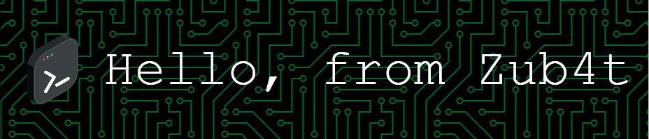

<h1> Welcome to my domain</h1>

  

I'm zub4t/sushll a tech passionate, M.Sc in Network and System graduated from the U.Porto 

<h2>Comfortable programming at <h2>

  
   
  
  
  
  
  
  
  
  
  
  
  
  
  
  
  
  

